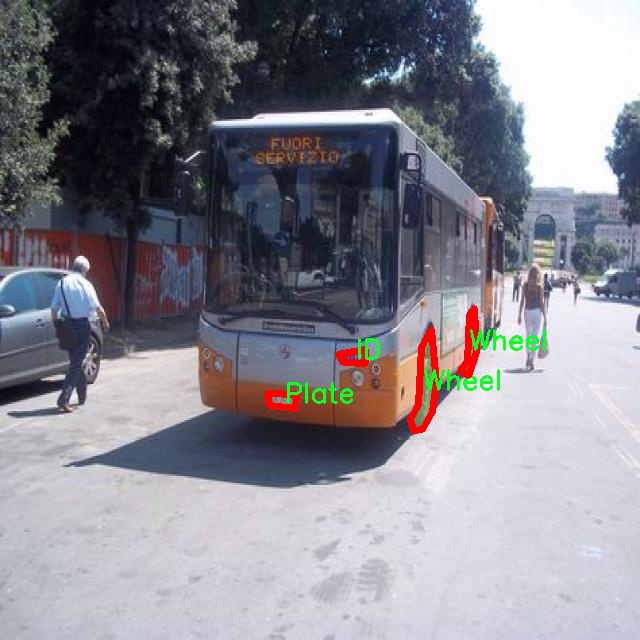

### 1.背景意义

研究背景与意义

随着城市化进程的加快，公共交通系统的需求日益增加，公交车作为城市交通的重要组成部分，其运行效率和安全性直接影响到城市的交通状况和居民的出行体验。因此，公交车的维护和管理显得尤为重要。在这一背景下，公交车部件的实例分割技术应运而生，成为提升公交车管理智能化水平的重要手段。通过对公交车各个部件进行精准的实例分割，可以实现对公交车状态的实时监控，及时发现潜在的故障和安全隐患，从而提高公交车的运行安全性和可靠性。

本研究旨在基于改进的YOLOv11模型，构建一个高效的公交车部件实例分割系统。YOLO（You Only Look Once）系列模型因其快速和准确的特性，广泛应用于目标检测和实例分割任务。YOLOv11作为该系列的最新版本，具备更强的特征提取能力和更高的检测精度，适合处理复杂的公交车部件图像数据。我们将利用一个包含1000张公交车部件图像的数据集，数据集中涵盖了门、车牌、车轮等8个类别的部件，提供了丰富的实例分割训练样本。

通过对该数据集的深入分析和处理，我们期望能够提高模型在公交车部件实例分割任务中的表现，进而为公交车的智能监控和管理提供技术支持。此外，研究成果不仅有助于公交车行业的智能化发展，也为其他交通工具的部件监测提供了借鉴，推动整个交通领域的技术进步。因此，本项目的研究具有重要的理论意义和广泛的应用前景。

### 2.视频效果

[2.1 视频效果](https://www.bilibili.com/video/BV1FJqgYhEso/)

### 3.图片效果


##### [项目涉及的源码数据来源链接](https://kdocs.cn/l/cszuIiCKVNis)**

注意：本项目提供训练的数据集和训练教程,由于版本持续更新,暂不提供权重文件（best.pt）,请按照6.训练教程进行训练后实现上图演示的效果。

### 4.数据集信息

##### 4.1 本项目数据集类别数＆类别名

nc: 4
names: ['Door', 'ID', 'Plate', 'Wheel']


该项目为【图像分割】数据集，请在【训练教程和Web端加载模型教程（第三步）】这一步的时候按照【图像分割】部分的教程来训练

##### 4.2 本项目数据集信息介绍

本项目数据集信息介绍

本项目所使用的数据集名为“BusPartsSegmentation”，旨在为改进YOLOv11的公交车部件实例分割系统提供支持。该数据集专注于公交车的关键部件，涵盖了四个主要类别，分别是“Door”（门）、“ID”（标识牌）、“Plate”（车牌）和“Wheel”（轮胎）。这些类别的选择不仅反映了公交车的基本构造特征，也为实例分割任务提供了丰富的标注信息。

在数据集的构建过程中，我们收集了大量公交车的图像，确保涵盖不同品牌、型号及颜色的公交车，以增强模型的泛化能力。每个图像均经过精细标注，确保每个部件的边界清晰可辨。通过对公交车各个部件的精确标注，数据集能够有效支持模型在复杂场景下的学习，提升其对公交车部件的识别和分割能力。

此外，数据集的多样性也为模型训练提供了坚实的基础。我们确保数据集中包含了不同光照条件、天气状况和拍摄角度下的公交车图像，这将有助于模型在实际应用中应对各种环境变化。通过对这些数据的充分利用，模型能够更好地理解公交车部件的形状、颜色和位置，从而实现更高精度的实例分割。

总之，“BusPartsSegmentation”数据集不仅为YOLOv11的改进提供了必要的训练素材，也为未来公交车相关研究提供了宝贵的数据支持。通过对该数据集的深入分析和应用，我们期望能够推动公交车部件实例分割技术的发展，为智能交通系统的实现奠定基础。





### 5.全套项目环境部署视频教程（零基础手把手教学）

[5.1 所需软件PyCharm和Anaconda安装教程（第一步）](https://www.bilibili.com/video/BV1BoC1YCEKi/?spm_id_from=333.999.0.0&vd_source=bc9aec86d164b67a7004b996143742dc)


[5.2 安装Python虚拟环境创建和依赖库安装视频教程（第二步）](https://www.bilibili.com/video/BV1ZoC1YCEBw?spm_id_from=333.788.videopod.sections&vd_source=bc9aec86d164b67a7004b996143742dc)

### 6.改进YOLOv11训练教程和Web_UI前端加载模型教程（零基础手把手教学）

[6.1 改进YOLOv11训练教程和Web_UI前端加载模型教程（第三步）](https://www.bilibili.com/video/BV1BoC1YCEhR?spm_id_from=333.788.videopod.sections&vd_source=bc9aec86d164b67a7004b996143742dc)


按照上面的训练视频教程链接加载项目提供的数据集，运行train.py即可开始训练



     Epoch   gpu_mem       box       obj       cls    labels  img_size
     1/200     20.8G   0.01576   0.01955  0.007536        22      1280: 100%|██████████| 849/849 [14:42<00:00,  1.04s/it]
               Class     Images     Labels          P          R     mAP@.5 mAP@.5:.95: 100%|██████████| 213/213 [01:14<00:00,  2.87it/s]
                 all       3395      17314      0.994      0.957      0.0957      0.0843

     Epoch   gpu_mem       box       obj       cls    labels  img_size
     2/200     20.8G   0.01578   0.01923  0.007006        22      1280: 100%|██████████| 849/849 [14:44<00:00,  1.04s/it]
               Class     Images     Labels          P          R     mAP@.5 mAP@.5:.95: 100%|██████████| 213/213 [01:12<00:00,  2.95it/s]
                 all       3395      17314      0.996      0.956      0.0957      0.0845

     Epoch   gpu_mem       box       obj       cls    labels  img_size
     3/200     20.8G   0.01561    0.0191  0.006895        27      1280: 100%|██████████| 849/849 [10:56<00:00,  1.29it/s]
               Class     Images     Labels          P          R     mAP@.5 mAP@.5:.95: 100%|███████   | 187/213 [00:52<00:00,  4.04it/s]
                 all       3395      17314      0.996      0.957      0.0957      0.0845


###### [项目数据集下载链接](https://kdocs.cn/l/cszuIiCKVNis)

### 7.原始YOLOv11算法讲解


其实到了YOLOV11 基本创新点就不太多了，主要就是大家互相排列组合复用不同的网络模块、损失函数和样本匹配策略，需要注意YOLO V5、V8 V11
都是1个公司的，其余的个人建议看看V8的，剩下的了解就好。

V11支持多种视觉任务：物体检测、实例分割、图像分类、姿态估计和定向物体检测（OBB）。

##### YOLOv11
基本和YOLOV8同源，甚至git目前都是1个，部分代码注释还是YOLOV8的，所以建议先看我写的YOLOV8相关博客，对比YOLOV8主要涉及到：

*backbone 中的使用C2f模块 变为 c3k2 模块。

*backbone 中的最后一层（sppf层）后增加了C2PSA模块。

*head 解耦头中的分类检测头两个Conv 变为 DWConv。

整体技术而言：

*backbone 使用了C2K2模块+最后SPPF模块级联C2PSA模块；

*neck 使用PAN结构，并且里面也使用C3K2模块；

*head使用了anchor-free + Decoupled-head，其中回归头使用正常的卷积，分类头使用DWConv；

*损失函数使用了分类BCE、回归CIOU + VFL的组合；

*框匹配策略由静态匹配改为了Task-Aligned Assigner匹配方式；

*训练策略没有提及，其中YOLOV8可以参考如下最后 10 个 epoch 关闭 Mosaic 的操作、训练总 epoch 数从 300 提升到了 500。

##### 主要思路


配置文件：[ultralytics/ultralytics/cfg/models/11/yolo11.yaml at main ·
ultralytics/ultralytics ·
GitHub](https://github.com/ultralytics/ultralytics/blob/main/ultralytics/cfg/models/11/yolo11.yaml
"ultralytics/ultralytics/cfg/models/11/yolo11.yaml at main ·
ultralytics/ultralytics · GitHub")

解析函数：[ultralytics/ultralytics/nn/tasks.py at main · ultralytics/ultralytics ·
GitHub](https://github.com/ultralytics/ultralytics/blob/main/ultralytics/nn/tasks.py#L934
"ultralytics/ultralytics/nn/tasks.py at main · ultralytics/ultralytics ·
GitHub")


##### 具体细节

##### input

输入要求以及预处理，可选项比较多，可以参考这个配置文件：[ultralytics/ultralytics/cfg/default.yaml at main
· ultralytics/ultralytics ·
GitHub](https://github.com/ultralytics/ultralytics/blob/main/ultralytics/cfg/default.yaml
"ultralytics/ultralytics/cfg/default.yaml at main · ultralytics/ultralytics ·
GitHub") 的Hyperparameters 部分。

基础输入仍然为640*640。预处理就是熟悉的letterbox（根据参数配置可以为不同的缩放填充模式，主要用于resize到640）+
转换rgb、chw、int8(0-255)->float（0-1），注意没有归一化操作。需要注意的是作者实现的mosaic和网上看到的不同，对比如下图（左边网上版本，右边是YOLO的实现）。并且作者添加了在最后10轮关闭mosaic增强（YOLOV8开始支持，具体原因个人的经验如我的这篇文章：yolov5
mosaic相关，关闭参数在 Train settings 部分的close_mosaic 选项）


##### backbone

主干网络以及改进

这里不去特意强调对比YOLOv5、V8等等的改进，因为各个系列都在疯狂演进，个人认为没必要花费时间看差异，着重看看一些比较重要的模块即可。源代码：

大多数模块：[ultralytics/ultralytics/nn/modules/block.py at main ·
ultralytics/ultralytics ·
GitHub](https://github.com/ultralytics/ultralytics/blob/main/ultralytics/nn/modules/block.py
"ultralytics/ultralytics/nn/modules/block.py at main · ultralytics/ultralytics
· GitHub")

head 部分：[ultralytics/ultralytics/nn/modules/head.py at main ·
ultralytics/ultralytics ·
GitHub](https://github.com/ultralytics/ultralytics/blob/main/ultralytics/nn/modules/head.py
"ultralytics/ultralytics/nn/modules/head.py at main · ultralytics/ultralytics
· GitHub")

串联模块构造网络：[ultralytics/ultralytics/nn/tasks.py at main ·
ultralytics/ultralytics ·
GitHub](https://github.com/ultralytics/ultralytics/blob/main/ultralytics/nn/tasks.py
"ultralytics/ultralytics/nn/tasks.py at main · ultralytics/ultralytics ·
GitHub")

##### 1）CBS 模块（后面叫做Conv）

就是pytorch 自带的conv + BN +SiLU，这里对应上面的配置文件的Conv 的 args 比如[64, 3, 2] 就是 conv2d
的c2=64、k=3、 s =2、c1 自动为上一层参数、p 为自动计算，真实需要计算scales 里面的with 和 max_channels 缩放系数。

这里连续使用两个3*3卷积stride为2的CBS模块直接横竖各降低了4倍分辨率（整体变为原来1/16）。这个还是比较猛的，敢在如此小的感受野下连续两次仅仅用一层卷积就下采样,当然作为代价它的特征图还是比较厚的分别为16、32。


    
    
        class Conv(nn.Module):
        """Standard convolution with args(ch_in, ch_out, kernel, stride, padding, groups, dilation, activation)."""
    
        default_act = nn.SiLU()  # default activation
    
        def __init__(self, c1, c2, k=1, s=1, p=None, g=1, d=1, act=True):
            """Initialize Conv layer with given arguments including activation."""
            super().__init__()
            self.conv = nn.Conv2d(c1, c2, k, s, autopad(k, p, d), groups=g, dilation=d, bias=False)
            self.bn = nn.BatchNorm2d(c2)
            self.act = self.default_act if act is True else act if isinstance(act, nn.Module) else nn.Identity()
    
        def forward(self, x):
            """Apply convolution, batch normalization and activation to input tensor."""
            return self.act(self.bn(self.conv(x)))
    
        def forward_fuse(self, x):
            """Perform transposed convolution of 2D data."""
            return self.act(self.conv(x))

##### 2）c3k2 模块

##### Bottleneck

有两种结构，需要参数shortcut和两个conv的宽度是否相同来控制。

##### C3 & C3K

都是CSP bottleneck module with 3 convolutions, C3 代表3个卷积层，
K代表其中bottleneck中的卷积核为支持自定义，其实这里c3k作者使用的默认的3*3卷积核也就等同于使用c3(c3是3*3卷积核)。

##### c2f & c3k2

其实也就是仿照YOLOv7 的ELAN
结构，通过更多的分支夸层链接，丰富了模型的梯度流。C3K2模块其实就是C2F模块转变出来的，它代码中有一个设置，就是当c3k这个参数为FALSE的时候，C3K2模块就是C2F模块，也就是说它的Bottleneck是普通的Bottleneck；反之当它为true的时候，将Bottleneck模块替换成C3K模块。模块中存在
Split 等操作对特定硬件部署没有之前那么友好了。需要针对自己的硬件进行测试看对最终推理速度的影响。

可视化关系如下，这里需要注意配置文件中的参数，比如21行[-1, 2, C3k2, [512, False, 0.25]]
512代表宽度、false代表是否使用shortcut、0.25代表c2f的宽度缩放。也就是第一个Conv的输出宽度。


源代码如下:

    
    
    class Bottleneck(nn.Module):
        """Standard bottleneck."""
    
        def __init__(self, c1, c2, shortcut=True, g=1, k=(3, 3), e=0.5):
            """Initializes a standard bottleneck module with optional shortcut connection and configurable parameters."""
            super().__init__()
            c_ = int(c2 * e)  # hidden channels
            self.cv1 = Conv(c1, c_, k[0], 1)
            self.cv2 = Conv(c_, c2, k[1], 1, g=g)
            self.add = shortcut and c1 == c2
    
        def forward(self, x):
            """Applies the YOLO FPN to input data."""
            return x + self.cv2(self.cv1(x)) if self.add else self.cv2(self.cv1(x))
    
    class C3(nn.Module):
        """CSP Bottleneck with 3 convolutions."""
    
        def __init__(self, c1, c2, n=1, shortcut=True, g=1, e=0.5):
            """Initialize the CSP Bottleneck with given channels, number, shortcut, groups, and expansion values."""
            super().__init__()
            c_ = int(c2 * e)  # hidden channels
            self.cv1 = Conv(c1, c_, 1, 1)
            self.cv2 = Conv(c1, c_, 1, 1)
            self.cv3 = Conv(2 * c_, c2, 1)  # optional act=FReLU(c2)
            self.m = nn.Sequential(*(Bottleneck(c_, c_, shortcut, g, k=((1, 1), (3, 3)), e=1.0) for _ in range(n)))
    
        def forward(self, x):
            """Forward pass through the CSP bottleneck with 2 convolutions."""
            return self.cv3(torch.cat((self.m(self.cv1(x)), self.cv2(x)), 1))
    
    class C3k(C3):
        """C3k is a CSP bottleneck module with customizable kernel sizes for feature extraction in neural networks."""
    
        def __init__(self, c1, c2, n=1, shortcut=True, g=1, e=0.5, k=3):
            """Initializes the C3k module with specified channels, number of layers, and configurations."""
            super().__init__(c1, c2, n, shortcut, g, e)
            c_ = int(c2 * e)  # hidden channels
            # self.m = nn.Sequential(*(RepBottleneck(c_, c_, shortcut, g, k=(k, k), e=1.0) for _ in range(n)))
            self.m = nn.Sequential(*(Bottleneck(c_, c_, shortcut, g, k=(k, k), e=1.0) for _ in range(n)))
    
    class C2f(nn.Module):
        """Faster Implementation of CSP Bottleneck with 2 convolutions."""
    
        def __init__(self, c1, c2, n=1, shortcut=False, g=1, e=0.5):
            """Initializes a CSP bottleneck with 2 convolutions and n Bottleneck blocks for faster processing."""
            super().__init__()
            self.c = int(c2 * e)  # hidden channels
            self.cv1 = Conv(c1, 2 * self.c, 1, 1)
            self.cv2 = Conv((2 + n) * self.c, c2, 1)  # optional act=FReLU(c2)
            self.m = nn.ModuleList(Bottleneck(self.c, self.c, shortcut, g, k=((3, 3), (3, 3)), e=1.0) for _ in range(n))
    
        def forward(self, x):
            """Forward pass through C2f layer."""
            y = list(self.cv1(x).chunk(2, 1))
            y.extend(m(y[-1]) for m in self.m)
            return self.cv2(torch.cat(y, 1))
    
        def forward_split(self, x):
            """Forward pass using split() instead of chunk()."""
            y = list(self.cv1(x).split((self.c, self.c), 1))
            y.extend(m(y[-1]) for m in self.m)
            return self.cv2(torch.cat(y, 1))
    
    class C3k2(C2f):
        """Faster Implementation of CSP Bottleneck with 2 convolutions."""
    
        def __init__(self, c1, c2, n=1, c3k=False, e=0.5, g=1, shortcut=True):
            """Initializes the C3k2 module, a faster CSP Bottleneck with 2 convolutions and optional C3k blocks."""
            super().__init__(c1, c2, n, shortcut, g, e)
            self.m = nn.ModuleList(
                C3k(self.c, self.c, 2, shortcut, g) if c3k else Bottleneck(self.c, self.c, shortcut, g) for _ in range(n)
            )

##### 3）sppf 模块

对比spp，将简单的并行max pooling 改为串行+并行的方式。对比如下（左边是SPP，右边是SPPF）：


    
    
        class SPPF(nn.Module):
        # Spatial Pyramid Pooling - Fast (SPPF) layer for YOLOv5 by Glenn Jocher
        def __init__(self, c1, c2, k=5):  # equivalent to SPP(k=(5, 9, 13))
            super().__init__()
            c_ = c1 // 2  # hidden channels
            self.cv1 = Conv(c1, c_, 1, 1)
            self.cv2 = Conv(c_ * 4, c2, 1, 1)
            self.m = nn.MaxPool2d(kernel_size=k, stride=1, padding=k // 2)
    
        def forward(self, x):
            x = self.cv1(x)
            with warnings.catch_warnings():
                warnings.simplefilter('ignore')  # suppress torch 1.9.0 max_pool2d() warning
                y1 = self.m(x)
                y2 = self.m(y1)
                return self.cv2(torch.cat((x, y1, y2, self.m(y2)), 1))

##### 4）C2PSA 模块

C2PSA它结合了PSA(Pointwise Spatial
Attention)块，用于增强特征提取和注意力机制。下面的图建议从左到右看，这样才能更有条理的理解，其实PSA个人感觉就是仿着VIT
的Attention来做的，是把输入C2PSA的特征图的h*w 看做VIT 的path数（也可以理解为NLP中token 个数），特征图的channel
数看做VIT特征维度（CNN的宽度，或者理解为NLP中token
编码后的特征维度），然后计算出QKV（这里需要注意第四幅图的QKV是值，不是操作，所以标注成了圆角矩形，这里是为了大家好理解），这里的Attention其实是在h*w维度计算空间Attention，个人感觉是强制给了全局感受野，并且并联了一个3*3的深度可分离卷积的单空间部分，就是仅在每一个特征图上进行3*3卷积，具体实现是通过pytorch
conv2d 的
group参数设置为特征图的通道数。特别的关于Conv的参数分别为：输入通道数、输出通道数、卷积核尺寸、pad尺寸、group数、是否有激活函数（默认silu）。图中的最后一幅省略了一些细节，可以参考源码。

注意区别C2fPSA，C2fPSA才是对 C2f 模块的扩展，通过在标准 C2f 模块中引入 PSA
块，C2fPSA实现了更强大的注意力机制，从而提高了模型对重要特征的捕捉能力。作者实现了该模块但最终没有使用。


涉及的源码：

    
    
    class Attention(nn.Module):
        """
        Attention module that performs self-attention on the input tensor.
    
        Args:
            dim (int): The input tensor dimension.
            num_heads (int): The number of attention heads.
            attn_ratio (float): The ratio of the attention key dimension to the head dimension.
    
        Attributes:
            num_heads (int): The number of attention heads.
            head_dim (int): The dimension of each attention head.
            key_dim (int): The dimension of the attention key.
            scale (float): The scaling factor for the attention scores.
            qkv (Conv): Convolutional layer for computing the query, key, and value.
            proj (Conv): Convolutional layer for projecting the attended values.
            pe (Conv): Convolutional layer for positional encoding.
        """
    
        def __init__(self, dim, num_heads=8, attn_ratio=0.5):
            """Initializes multi-head attention module with query, key, and value convolutions and positional encoding."""
            super().__init__()
            self.num_heads = num_heads
            self.head_dim = dim // num_heads
            self.key_dim = int(self.head_dim * attn_ratio)
            self.scale = self.key_dim**-0.5
            nh_kd = self.key_dim * num_heads
            h = dim + nh_kd * 2
            self.qkv = Conv(dim, h, 1, act=False)
            self.proj = Conv(dim, dim, 1, act=False)
            self.pe = Conv(dim, dim, 3, 1, g=dim, act=False)
    
        def forward(self, x):
            """
            Forward pass of the Attention module.
    
            Args:
                x (torch.Tensor): The input tensor.
    
            Returns:
                (torch.Tensor): The output tensor after self-attention.
            """
            B, C, H, W = x.shape
            N = H * W
            qkv = self.qkv(x)
            q, k, v = qkv.view(B, self.num_heads, self.key_dim * 2 + self.head_dim, N).split(
                [self.key_dim, self.key_dim, self.head_dim], dim=2
            )
    
            attn = (q.transpose(-2, -1) @ k) * self.scale
            attn = attn.softmax(dim=-1)
            x = (v @ attn.transpose(-2, -1)).view(B, C, H, W) + self.pe(v.reshape(B, C, H, W))
            x = self.proj(x)
            return x
    
    class PSABlock(nn.Module):
        """
        PSABlock class implementing a Position-Sensitive Attention block for neural networks.
    
        This class encapsulates the functionality for applying multi-head attention and feed-forward neural network layers
        with optional shortcut connections.
    
        Attributes:
            attn (Attention): Multi-head attention module.
            ffn (nn.Sequential): Feed-forward neural network module.
            add (bool): Flag indicating whether to add shortcut connections.
    
        Methods:
            forward: Performs a forward pass through the PSABlock, applying attention and feed-forward layers.
    
        Examples:
            Create a PSABlock and perform a forward pass
            >>> psablock = PSABlock(c=128, attn_ratio=0.5, num_heads=4, shortcut=True)
            >>> input_tensor = torch.randn(1, 128, 32, 32)
            >>> output_tensor = psablock(input_tensor)
        """
    
        def __init__(self, c, attn_ratio=0.5, num_heads=4, shortcut=True) -> None:
            """Initializes the PSABlock with attention and feed-forward layers for enhanced feature extraction."""
            super().__init__()
    
            self.attn = Attention(c, attn_ratio=attn_ratio, num_heads=num_heads)
            self.ffn = nn.Sequential(Conv(c, c * 2, 1), Conv(c * 2, c, 1, act=False))
            self.add = shortcut
    
        def forward(self, x):
            """Executes a forward pass through PSABlock, applying attention and feed-forward layers to the input tensor."""
            x = x + self.attn(x) if self.add else self.attn(x)
            x = x + self.ffn(x) if self.add else self.ffn(x)
            return x
        
    class C2PSA(nn.Module):
        """
        C2PSA module with attention mechanism for enhanced feature extraction and processing.
    
        This module implements a convolutional block with attention mechanisms to enhance feature extraction and processing
        capabilities. It includes a series of PSABlock modules for self-attention and feed-forward operations.
    
        Attributes:
            c (int): Number of hidden channels.
            cv1 (Conv): 1x1 convolution layer to reduce the number of input channels to 2*c.
            cv2 (Conv): 1x1 convolution layer to reduce the number of output channels to c.
            m (nn.Sequential): Sequential container of PSABlock modules for attention and feed-forward operations.
    
        Methods:
            forward: Performs a forward pass through the C2PSA module, applying attention and feed-forward operations.
    
        Notes:
            This module essentially is the same as PSA module, but refactored to allow stacking more PSABlock modules.
    
        Examples:
            >>> c2psa = C2PSA(c1=256, c2=256, n=3, e=0.5)
            >>> input_tensor = torch.randn(1, 256, 64, 64)
            >>> output_tensor = c2psa(input_tensor)
        """
    
        def __init__(self, c1, c2, n=1, e=0.5):
            """Initializes the C2PSA module with specified input/output channels, number of layers, and expansion ratio."""
            super().__init__()
            assert c1 == c2
            self.c = int(c1 * e)
            self.cv1 = Conv(c1, 2 * self.c, 1, 1)
            self.cv2 = Conv(2 * self.c, c1, 1)
    
            self.m = nn.Sequential(*(PSABlock(self.c, attn_ratio=0.5, num_heads=self.c // 64) for _ in range(n)))
    
        def forward(self, x):
            """Processes the input tensor 'x' through a series of PSA blocks and returns the transformed tensor."""
            a, b = self.cv1(x).split((self.c, self.c), dim=1)
            b = self.m(b)
            return self.cv2(torch.cat((a, b), 1))

##### 3、neck & head

##### 1）检测头

YOLOV11 Head 部分和YOLOV8是近似的，所以简单对比YOLOV5、V8、V11。


如上面图，上边是YOLOV5 的结构，中是YOLOv8 的结构，下面是YOLOV11 结构

Yolov5: 检测和分类共用一个卷积（coupled head）并且是anchor based ,其 卷积输出为（5+N class）*3，其中
5为bbox 四个值（具体代表什么不同版本略有不同，官方git有说明，历史版本见 目标检测算法——YOLOV5 ）+ 一个obj 值
（是否有目标，这个是从YOLO V1 传承下来的，个人感觉有点绕和不合理，并且后面取消），N class 为类别数，3为anchor 的数量，默认是3个。

YOLOv8：检测和分类的卷积是解耦的（decoupled），如中图，上面一条卷积支路是回归框，框的特征图channel为4*regmax，关于这个regmax
后面我们详细的解释,并不是anchor；分类的channel 为类别数。

YOLOV11：检测和分类的卷积是解耦的（decoupled），如右图，上面一条卷积支路是回归框，框的特征图channel为4*regmax，关于这个regmax
后面我们详细的解释,并不是anchor；分类的channel 为类别数，分类使用深度可分离卷积替代常规卷积降低计算量。

源码部分如下

    
    
    class Detect(nn.Module):
        """YOLO Detect head for detection models."""
    
        dynamic = False  # force grid reconstruction
        export = False  # export mode
        end2end = False  # end2end
        max_det = 300  # max_det
        shape = None
        anchors = torch.empty(0)  # init
        strides = torch.empty(0)  # init
    
        def __init__(self, nc=80, ch=()):
            """Initializes the YOLO detection layer with specified number of classes and channels."""
            super().__init__()
            self.nc = nc  # number of classes
            self.nl = len(ch)  # number of detection layers
            self.reg_max = 16  # DFL channels (ch[0] // 16 to scale 4/8/12/16/20 for n/s/m/l/x)
            self.no = nc + self.reg_max * 4  # number of outputs per anchor
            self.stride = torch.zeros(self.nl)  # strides computed during build
            c2, c3 = max((16, ch[0] // 4, self.reg_max * 4)), max(ch[0], min(self.nc, 100))  # channels
            self.cv2 = nn.ModuleList(
                nn.Sequential(Conv(x, c2, 3), Conv(c2, c2, 3), nn.Conv2d(c2, 4 * self.reg_max, 1)) for x in ch
            )
            self.cv3 = nn.ModuleList(
                nn.Sequential(
                    nn.Sequential(DWConv(x, x, 3), Conv(x, c3, 1)),
                    nn.Sequential(DWConv(c3, c3, 3), Conv(c3, c3, 1)),
                    nn.Conv2d(c3, self.nc, 1),
                )
                for x in ch
            )
            self.dfl = DFL(self.reg_max) if self.reg_max > 1 else nn.Identity()
    
            if self.end2end:
                self.one2one_cv2 = copy.deepcopy(self.cv2)
                self.one2one_cv3 = copy.deepcopy(self.cv3)
    
        def forward(self, x):
            """Concatenates and returns predicted bounding boxes and class probabilities."""
            if self.end2end:
                return self.forward_end2end(x)
    
            for i in range(self.nl):
                x[i] = torch.cat((self.cv2[i](x[i]), self.cv3[i](x[i])), 1)
            if self.training:  # Training path
                return x
            y = self._inference(x)
            return y if self.export else (y, x)

因此主要的变化可以认为有三个：（1）coupled head -> decoupled head ；（2）obj 分支消失；（3）anchor
based——> anchor free ; 4) 深度可分离卷积。

（1）coupled head -> decoupled head

这个解耦操作，看YOLO x 的论文，约有1% 的提升。逻辑和实现都比较直观易懂，不再赘述。

（2）obj 分支消失；

这个其实我自己再看YOLO V1 的时候就有疑问，它存在的意义。后来人们发现，其实obj
的在训练和推理过程中存在逻辑不一致性。具体而言（摘自“<https://zhuanlan.zhihu.com/p/147691786>”）

A。用法不一致。训练的时候，分类和质量估计各自训练自个儿的，但测试的时候却又是乘在一起作为NMS score排序的依据，这个操作显然没有end-to-
end，必然存在一定的gap。（个人认为还好，就是两个监督信号）

B。对象不一致。借助Focal
Loss的力量，分类分支能够使得少量的正样本和大量的负样本一起成功训练，但是质量估计通常就只针对正样本训练。那么，对于one-
stage的检测器而言，在做NMS
score排序的时候，所有的样本都会将分类score和质量预测score相乘用于排序，那么必然会存在一部分分数较低的“负样本”的质量预测是没有在训练过程中有监督信号的，对于大量可能的负样本，他们的质量预测是一个未定义行为。这就很有可能引发这么一个情况：一个分类score相对低的真正的负样本，由于预测了一个不可信的极高的质量score，而导致它可能排到一个真正的正样本（分类score不够高且质量score相对低）的前面。问题一如图所示：


（3）anchor based——> anchor free

这里主要涉及怎么定义回归内容以及如何匹配GT框的问题。也就是如下：

##### 2）匹配策略

A。回归的内容当前版本就是回归的lftp四个值（这四个值是距离匹配到的anchor 点的距离值！不是图片的绝对位置）。后面推理阶段通过
dist2bbox函数转换为需要的格式：

[
https://github.com/ultralytics/ultralytics/blob/cc3c774bde86ffce694d202b7383da6cc1721c1b/ultralytics/nn/modules.py#L378](https://github.com/ultralytics/ultralytics/blob/cc3c774bde86ffce694d202b7383da6cc1721c1b/ultralytics/nn/modules.py#L378
"  
 https://github.com/ultralytics/ultralytics/blob/cc3c774bde86ffce694d202b7383da6cc1721c1b/ultralytics/nn/modules.py#L378")

[
https://github.com/ultralytics/ultralytics/blob/cc3c774bde86ffce694d202b7383da6cc1721c1b/ultralytics/yolo/utils/tal.py#L196](https://github.com/ultralytics/ultralytics/blob/cc3c774bde86ffce694d202b7383da6cc1721c1b/ultralytics/yolo/utils/tal.py#L196
"  
 https://github.com/ultralytics/ultralytics/blob/cc3c774bde86ffce694d202b7383da6cc1721c1b/ultralytics/yolo/utils/tal.py#L196")。

    
    
       def dist2bbox(distance, anchor_points, xywh=True, dim=-1):
        """Transform distance(ltrb) to box(xywh or xyxy)."""
        lt, rb = torch.split(distance, 2, dim)
        x1y1 = anchor_points - lt
        x2y2 = anchor_points + rb
        if xywh:
            c_xy = (x1y1 + x2y2) / 2
            wh = x2y2 - x1y1
            return torch.cat((c_xy, wh), dim)  # xywh bbox
        return torch.cat((x1y1, x2y2), dim)  # xyxy bbox

##### B.匹配策略

YOLOv5 采用静态的匹配策略，V8采用了动态的TaskAlignedAssigner，其余常见的动态匹配还有： YOLOX 的 simOTA、TOOD
的 TaskAlignedAssigner 和 RTMDet 的 DynamicSoftLabelAssigner。


TaskAligned使用分类得分和IoU的高阶组合来衡量Task-Alignment的程度。使用上面公式来对每个实例计算Anchor-level
的对齐程度：s 和 u 分别为分类得分和 IoU 值，α 和 β 为权重超参。t 可以同时控制分类得分和IoU 的优化来实现 Task-
Alignment，可以引导网络动态的关注于高质量的Anchor。采用一种简单的分配规则选择训练样本：对每个实例，选择m个具有最大t值的Anchor作为正样本，选择其余的Anchor作为负样本。然后，通过损失函数(针对分类与定位的对齐而设计的损失函数)进行训练。

代码地址：[ultralytics/ultralytics/yolo/utils/tal.py at
c0c0c138c12699807ff9446f942cb3bd325d670b · ultralytics/ultralytics ·
GitHub](https://github.com/ultralytics/ultralytics/blob/c0c0c138c12699807ff9446f942cb3bd325d670b/ultralytics/yolo/utils/tal.py#L56
"ultralytics/ultralytics/yolo/utils/tal.py at
c0c0c138c12699807ff9446f942cb3bd325d670b · ultralytics/ultralytics · GitHub")

默认参数如下（当前版本这些超参没有提供修改的接口，如需修改需要在源码上进行修改）：


##### 4、loss function

损失函数设计

Loss 计算包括 2 个分支： 分类和回归分支，没有了之前的 objectness 分支。

分类分支依然采用 BCE Loss。回归分支使用了 Distribution Focal Loss（DFL Reg_max默认为16）+ CIoU
Loss。3 个 Loss
采用一定权重比例加权即可（默认如下：<https://github.com/ultralytics/ultralytics/blob/main/ultralytics/yolo/configs/default.yaml#L83>）。


这里重点介绍一下DFL损失。目前被广泛使用的bbox表示可以看作是对bbox方框坐标建模了单一的狄拉克分布。但是在复杂场景中，一些检测对象的边界并非十分明确。如下图左面所示，对于滑板左侧被水花模糊，引起对左边界的预测分布是任意而扁平的，对右边界的预测分布是明确而尖锐的。对于这个问题，有学者提出直接回归一个任意分布来建模边界框，使用softmax实现离散的回归，将狄拉克分布的积分形式推导到一般形式的积分形式来表示边界框。


狄拉克分布可以认为在一个点概率密度为无穷大，其他点概率密度为0，这是一种极端地认为离散的标签时绝对正确的。


因为标签是一个离散的点，如果把标签认为是绝对正确的目标，那么学习出的就是狄拉克分布，概率密度是一条尖锐的竖线。然而真实场景，物体边界并非是十分明确的，因此学习一个宽范围的分布更为合理。我们需要获得的分布虽然不再像狄拉克分布那么极端（只存在标签值），但也应该在标签值附近。因此学者提出Distribution
Focal
Loss损失函数，目的让网络快速聚焦到标签附近的数值，是标签处的概率密度尽量大。思想是使用交叉熵函数，来优化标签y附近左右两个位置的概率，是网络分布聚焦到标签值附近。如下公式。Si
是网络的sigmod 输出（因为真是是多分类，所以是softmax），yi 和 yi+1 是上图的区间顺序，y是label
值。

具体而言，针对我们将DFL的超参数Reg_max 设置为16的情况下：

A。训练阶段：我们以回归left为例：目标的label 转换为ltrb后，y = （ left - 匹配到的anchor 中心点 x 坐标）/
当前的下采样倍数，假设求得3.2。那么i 就应该为3，yi = 3 ,yi+1 = 4。

B。推理阶段：因为没有label，直接将16个格子进行积分（离散变量为求和，也就是期望）结果就是最终的坐标偏移量（再乘以下采样倍数+
匹配到的anchor的对应坐标）


DFL的实现方式其实就是一个卷积：[ultralytics/ultralytics/nn/modules.py at
cc3c774bde86ffce694d202b7383da6cc1721c1b · ultralytics/ultralytics ·
GitHub](https://github.com/ultralytics/ultralytics/blob/cc3c774bde86ffce694d202b7383da6cc1721c1b/ultralytics/nn/modules.py#L67
"ultralytics/ultralytics/nn/modules.py at
cc3c774bde86ffce694d202b7383da6cc1721c1b · ultralytics/ultralytics · GitHub")

NOTE：作者代码中的超参数Reg_max是写死的——16，并且代码内部做了强制截断到16，如果要修改需要修改源码，如果你的输入是640，最大下采样到20*20，那么16是够用的，如果输入没有resize或者超过了640一定要自己设置这个Reg_max参数，否则如果目标尺寸还大，将无法拟合到这个偏移量。
比如1280*1280的图片，目标1280*960，最大下采样32倍，1280/32/2=20 > 16(除以2是因为是一半的偏移量)，超过了dfl
滑板右侧那个图的范围。至于为什么叫focal
loss的变体，有兴趣看一下这个<https://zhuanlan.zhihu.com/p/357415257>和<https://zhuanlan.zhihu.com/p/147691786>就可以，这里不再赘述是因为，如果先看这些，很容易犯晕，反而抓不住DFL
我认为的重点（离散的分布形式）

    
    
        class DFL(nn.Module):
        # Integral module of Distribution Focal Loss (DFL) proposed in Generalized Focal Loss https://ieeexplore.ieee.org/document/9792391
        def __init__(self, c1=16):
            super().__init__()
            self.conv = nn.Conv2d(c1, 1, 1, bias=False).requires_grad_(False)
            x = torch.arange(c1, dtype=torch.float)
            self.conv.weight.data[:] = nn.Parameter(x.view(1, c1, 1, 1))
            self.c1 = c1
    
        def forward(self, x):
            b, c, a = x.shape  # batch, channels, anchors
            return self.conv(x.view(b, 4, self.c1, a).transpose(2, 1).softmax(1)).view(b, 4, a)
            # return self.conv(x.view(b, self.c1, 4, a).softmax(1)).view(b, 4, a)


### 8.200+种全套改进YOLOV11创新点原理讲解

#### 8.1 200+种全套改进YOLOV11创新点原理讲解大全

由于篇幅限制，每个创新点的具体原理讲解就不全部展开，具体见下列网址中的改进模块对应项目的技术原理博客网址【Blog】（创新点均为模块化搭建，原理适配YOLOv5~YOLOv11等各种版本）

[改进模块技术原理博客【Blog】网址链接](https://gitee.com/qunmasj/good)


#### 8.2 精选部分改进YOLOV11创新点原理讲解

###### 这里节选部分改进创新点展开原理讲解(完整的改进原理见上图和[改进模块技术原理博客链接](https://gitee.com/qunmasj/good)【如果此小节的图加载失败可以通过CSDN或者Github搜索该博客的标题访问原始博客，原始博客图片显示正常】
### CBAM空间注意力机制
近年来，随着深度学习研究方向的火热，注意力机制也被广泛地应用在图像识别、语音识别和自然语言处理等领域，注意力机制在深度学习任务中发挥着举足轻重的作用。注意力机制借鉴于人类的视觉系统，例如，人眼在看到一幅画面时，会倾向于关注画面中的重要信息，而忽略其他可见的信息。深度学习中的注意力机制和人类视觉的注意力机制相似，通过扫描全局数据，从大量数据中选择出需要重点关注的、对当前任务更为重要的信息，然后对这部分信息分配更多的注意力资源，从这些信息中获取更多所需要的细节信息，而抑制其他无用的信息。而在深度学习中，则具体表现为给感兴趣的区域更高的权重，经过网络的学习和调整，得到最优的权重分配，形成网络模型的注意力，使网络拥有更强的学习能力，加快网络的收敛速度。
注意力机制通常可分为软注意力机制和硬注意力机制[4-5]。软注意力机制在选择信息时，不是从输入的信息中只选择1个，而会用到所有输入信息，只是各个信息对应的权重分配不同，然后输入网络模型进行计算;硬注意力机制则是从输入的信息中随机选取一个或者选择概率最高的信息，但是这一步骤通常是不可微的，导致硬注意力机制更难训练。因此，软注意力机制应用更为广泛，按照原理可将软注意力机制划分为:通道注意力机制（channel attention)、空间注意力机制(spatial attention）和混合域注意力机制(mixed attention)。
通道注意力机制的本质建立各个特征通道之间的重要程度，对感兴趣的通道进行重点关注，弱化不感兴趣的通道的作用;空间注意力的本质则是建模了整个空间信息的重要程度，然后对空间内感兴趣的区域进行重点关注，弱化其余非感兴趣区域的作用;混合注意力同时运用了通道注意力和空间注意力，两部分先后进行或并行，形成对通道特征和空间特征同时关注的注意力模型。

卷积层注意力模块(Convolutional Block Attention Module，CBAM）是比较常用的混合注意力模块，其先后集中了通道注意力模块和空间注意力模块，网络中加入该模块能有效提高网络性能，减少网络模型的计算量，模块结构如图所示。输入特征图首先经过分支的通道注意力模块，然后和主干的原特征图融合，得到具有通道注意力的特征图，接着经过分支的空间注意力模块，在和主干的特征图融合后，得到同时具有通道特征注意力和空间特征注意力的特征图。CBAM模块不改变输入特征图的大小，因此该模块是一个“即插即用”的模块，可以插入网络的任何位置。

通道注意力模块的结构示意图如图所示，通道注意力模块分支并行地对输入的特征图进行最大池化操作和平均池化操作，然后利用多层感知机对结果进行变换，得到应用于两个通道的变换结果，最后经过sigmoid激活函数将变换结果融合，得到具有通道注意力的通道特征图。

空间注意力模块示意图如图所示，将通道注意力模块输出的特征图作为该模块的输入特征图，首先对输入特征图进行基于通道的最大池化操作和平均池化操作，将两部分得到的结果拼接起来，然后通过卷积得到降为Ⅰ通道的特征图，最后通过sigmoid激活函数生成具有空间注意力的特征图。


### 9.系统功能展示

图9.1.系统支持检测结果表格显示

  图9.2.系统支持置信度和IOU阈值手动调节

  图9.3.系统支持自定义加载权重文件best.pt(需要你通过步骤5中训练获得)

  图9.4.系统支持摄像头实时识别

  图9.5.系统支持图片识别

  图9.6.系统支持视频识别

  图9.7.系统支持识别结果文件自动保存

  图9.8.系统支持Excel导出检测结果数据


### 10. YOLOv11核心改进源码讲解

#### 10.1 CTrans.py

以下是对给定代码的核心部分进行提炼和详细注释的结果。保留了最重要的类和方法，以便于理解整个结构和功能。

```python
# -*- coding: utf-8 -*-
import torch
import torch.nn as nn
import numpy as np
from torch.nn import Dropout, Softmax, Conv2d, LayerNorm

class Channel_Embeddings(nn.Module):
    """构建从图像块和位置嵌入的通道嵌入。"""
    def __init__(self, patchsize, img_size, in_channels):
        super().__init__()
        img_size = (img_size, img_size)  # 将图像大小转换为元组
        patch_size = (patchsize, patchsize)  # 将块大小转换为元组
        n_patches = (img_size[0] // patch_size[0]) * (img_size[1] // patch_size[1])  # 计算总块数

        # 定义块嵌入层
        self.patch_embeddings = nn.Sequential(
            nn.MaxPool2d(kernel_size=5, stride=5),  # 最大池化层
            Conv2d(in_channels=in_channels,
                    out_channels=in_channels,
                    kernel_size=patchsize // 5,
                    stride=patchsize // 5)  # 卷积层
        )

        # 定义位置嵌入
        self.position_embeddings = nn.Parameter(torch.zeros(1, n_patches, in_channels))
        self.dropout = Dropout(0.1)  # Dropout层

    def forward(self, x):
        """前向传播，计算嵌入。"""
        if x is None:
            return None
        x = self.patch_embeddings(x)  # 通过块嵌入层
        x = x.flatten(2)  # 展平
        x = x.transpose(-1, -2)  # 转置
        embeddings = x + self.position_embeddings  # 添加位置嵌入
        embeddings = self.dropout(embeddings)  # 应用Dropout
        return embeddings

class Attention_org(nn.Module):
    """多头注意力机制的实现。"""
    def __init__(self, vis, channel_num):
        super(Attention_org, self).__init__()
        self.vis = vis  # 可视化标志
        self.KV_size = sum(channel_num)  # 键值对的大小
        self.channel_num = channel_num  # 通道数
        self.num_attention_heads = 4  # 注意力头的数量

        # 定义查询、键、值的线性变换
        self.query = nn.ModuleList([nn.Linear(c, c, bias=False) for c in channel_num])
        self.key = nn.Linear(self.KV_size, self.KV_size, bias=False)
        self.value = nn.Linear(self.KV_size, self.KV_size, bias=False)

        self.softmax = Softmax(dim=3)  # Softmax层
        self.attn_dropout = Dropout(0.1)  # Dropout层

    def forward(self, emb_list, emb_all):
        """前向传播，计算注意力。"""
        multi_head_Q_list = [query(emb) for query, emb in zip(self.query, emb_list)]
        K = self.key(emb_all)  # 计算键
        V = self.value(emb_all)  # 计算值

        # 计算注意力分数
        attention_scores = [torch.matmul(Q, K) / np.sqrt(self.KV_size) for Q in multi_head_Q_list]
        attention_probs = [self.softmax(score) for score in attention_scores]  # 计算注意力概率

        # 应用Dropout
        attention_probs = [self.attn_dropout(prob) for prob in attention_probs]

        # 计算上下文层
        context_layers = [torch.matmul(prob, V) for prob in attention_probs]
        return context_layers

class Block_ViT(nn.Module):
    """ViT块的实现，包含注意力和前馈网络。"""
    def __init__(self, vis, channel_num):
        super(Block_ViT, self).__init__()
        self.attn_norm = LayerNorm(sum(channel_num), eps=1e-6)  # 归一化层
        self.channel_attn = Attention_org(vis, channel_num)  # 注意力机制
        self.ffn = nn.Sequential(
            nn.Linear(channel_num[0], channel_num[0] * 4),  # 前馈网络
            nn.GELU(),
            nn.Linear(channel_num[0] * 4, channel_num[0])
        )

    def forward(self, emb_list):
        """前向传播，计算注意力和前馈网络的输出。"""
        emb_all = torch.cat(emb_list, dim=2)  # 拼接所有嵌入
        emb_all = self.attn_norm(emb_all)  # 归一化
        context_layers = self.channel_attn(emb_list, emb_all)  # 计算上下文层
        output = [emb + context for emb, context in zip(emb_list, context_layers)]  # 残差连接
        return output

class Encoder(nn.Module):
    """编码器，包含多个ViT块。"""
    def __init__(self, vis, channel_num):
        super(Encoder, self).__init__()
        self.layer = nn.ModuleList([Block_ViT(vis, channel_num) for _ in range(1)])  # 多个ViT块

    def forward(self, emb_list):
        """前向传播，依次通过每个ViT块。"""
        for layer_block in self.layer:
            emb_list = layer_block(emb_list)  # 更新嵌入
        return emb_list

class ChannelTransformer(nn.Module):
    """通道变换器模型。"""
    def __init__(self, channel_num=[64, 128, 256, 512], img_size=640, vis=False, patchSize=[40, 20, 10, 5]):
        super().__init__()
        self.embeddings = nn.ModuleList([Channel_Embeddings(patchSize[i], img_size // (2 ** (i + 2)), channel_num[i]) for i in range(len(channel_num))])
        self.encoder = Encoder(vis, channel_num)  # 编码器

    def forward(self, en):
        """前向传播，计算嵌入和编码。"""
        emb_list = [embedding(en[i]) for i, embedding in enumerate(self.embeddings) if en[i] is not None]
        encoded = self.encoder(emb_list)  # 编码
        return encoded

class GetIndexOutput(nn.Module):
    """获取特定索引的输出。"""
    def __init__(self, index):
        super().__init__()
        self.index = index
    
    def forward(self, x):
        """前向传播，返回指定索引的输出。"""
        return x[self.index]
```

### 主要功能概述：
1. **Channel_Embeddings**: 负责将输入图像转换为嵌入，结合了位置嵌入。
2. **Attention_org**: 实现了多头注意力机制，计算注意力分数和上下文层。
3. **Block_ViT**: 组合了注意力机制和前馈网络，形成一个基本的ViT块。
4. **Encoder**: 由多个ViT块组成，负责对嵌入进行编码。
5. **ChannelTransformer**: 整个模型的主结构，负责处理输入并输出编码结果。
6. **GetIndexOutput**: 用于从输出中提取特定索引的结果。

以上代码片段经过精简和注释，旨在帮助理解模型的结构和功能。

这个程序文件 `CTrans.py` 实现了一个基于通道的变换器（Channel Transformer），用于处理图像数据。程序中定义了多个类，每个类都有其特定的功能，整体结构主要包括嵌入层、重建层、注意力机制、前馈网络和编码器等部分。

首先，`Channel_Embeddings` 类用于构建图像的嵌入表示。它通过最大池化和卷积操作将输入图像划分为多个小块（patch），并为每个小块生成位置嵌入。位置嵌入是通过一个可学习的参数实现的，最终的嵌入表示还会经过一个 dropout 层，以减少过拟合。

接下来，`Reconstruct` 类用于重建特征图。它接受经过注意力机制处理后的嵌入，使用卷积层和批归一化进行处理，并通过上采样将特征图恢复到原始图像的大小。

`Attention_org` 类实现了多头注意力机制。它接收多个嵌入作为输入，计算每个嵌入的查询（Q）、键（K）和值（V），并通过点积计算注意力分数。注意力分数经过 softmax 函数归一化后，与值相乘，得到最终的上下文层输出。这个类还支持可视化注意力权重。

`Mlp` 类是一个简单的前馈神经网络，包含两个线性层和一个激活函数（GELU）。它用于在变换器的每个块中对嵌入进行进一步处理。

`Block_ViT` 类是变换器的基本构建块，包含了注意力层和前馈网络。它首先对输入的嵌入进行层归一化，然后通过注意力机制和前馈网络进行处理，最后将输入和输出进行残差连接。

`Encoder` 类由多个 `Block_ViT` 组成，负责将输入的嵌入进行多次处理以提取特征。它在每个块之后应用层归一化，并在可视化模式下收集注意力权重。

`ChannelTransformer` 类是整个模型的核心，负责初始化嵌入层、编码器和重建层。它将输入的图像划分为多个通道，并通过嵌入层生成嵌入，随后经过编码器处理，最后通过重建层将特征图恢复到原始图像的大小。

最后，`GetIndexOutput` 类用于从模型的输出中提取特定索引的结果。

整体来看，这个程序实现了一个复杂的图像处理模型，利用了现代深度学习中的多头注意力机制和残差连接等技术，适用于需要处理多通道图像数据的任务。

#### 10.2 efficientViT.py

以下是经过简化和注释的核心代码部分，保留了EfficientViT模型的基本结构和功能。

```python
import torch
import torch.nn as nn
import torch.nn.functional as F
import itertools

# 定义一个卷积层和批归一化的组合
class Conv2d_BN(torch.nn.Sequential):
    def __init__(self, in_channels, out_channels, kernel_size=1, stride=1, padding=0):
        super().__init__()
        # 添加卷积层
        self.add_module('conv', nn.Conv2d(in_channels, out_channels, kernel_size, stride, padding, bias=False))
        # 添加批归一化层
        self.add_module('bn', nn.BatchNorm2d(out_channels))

    @torch.no_grad()
    def switch_to_deploy(self):
        # 将训练模式下的BN层转换为推理模式
        conv, bn = self._modules.values()
        w = bn.weight / (bn.running_var + bn.eps)**0.5
        w = conv.weight * w[:, None, None, None]
        b = bn.bias - bn.running_mean * bn.weight / (bn.running_var + bn.eps)**0.5
        # 创建新的卷积层并返回
        return nn.Conv2d(w.size(1), w.size(0), w.shape[2:], stride=conv.stride, padding=conv.padding, bias=True).apply(lambda m: (m.weight.data.copy_(w), m.bias.data.copy_(b)))

# 定义一个残差块
class Residual(nn.Module):
    def __init__(self, module):
        super().__init__()
        self.module = module

    def forward(self, x):
        return x + self.module(x)  # 残差连接

# 定义前馈网络
class FFN(nn.Module):
    def __init__(self, in_dim, hidden_dim):
        super().__init__()
        self.pw1 = Conv2d_BN(in_dim, hidden_dim)
        self.act = nn.ReLU()
        self.pw2 = Conv2d_BN(hidden_dim, in_dim)

    def forward(self, x):
        return self.pw2(self.act(self.pw1(x)))  # 前馈网络的前向传播

# 定义EfficientViT的基本模块
class EfficientViTBlock(nn.Module):
    def __init__(self, in_dim, hidden_dim):
        super().__init__()
        self.dw0 = Residual(Conv2d_BN(in_dim, in_dim, kernel_size=3, padding=1, stride=1))
        self.ffn0 = Residual(FFN(in_dim, hidden_dim))
        self.dw1 = Residual(Conv2d_BN(in_dim, in_dim, kernel_size=3, padding=1, stride=1))
        self.ffn1 = Residual(FFN(in_dim, hidden_dim))

    def forward(self, x):
        x = self.dw0(x)
        x = self.ffn0(x)
        x = self.dw1(x)
        return self.ffn1(x)

# 定义EfficientViT模型
class EfficientViT(nn.Module):
    def __init__(self, img_size=224, embed_dim=[64, 128, 192], depth=[1, 2, 3]):
        super().__init__()
        self.patch_embed = Conv2d_BN(3, embed_dim[0], kernel_size=3, stride=2, padding=1)
        self.blocks = nn.ModuleList()
        for i in range(len(depth)):
            for _ in range(depth[i]):
                self.blocks.append(EfficientViTBlock(embed_dim[i], embed_dim[i] * 2))

    def forward(self, x):
        x = self.patch_embed(x)
        for block in self.blocks:
            x = block(x)
        return x

# 创建EfficientViT模型实例
if __name__ == '__main__':
    model = EfficientViT()
    inputs = torch.randn((1, 3, 224, 224))  # 输入图像
    output = model(inputs)  # 前向传播
    print(output.size())  # 输出大小
```

### 代码说明：
1. **Conv2d_BN**: 该类实现了卷积层和批归一化层的组合，并提供了一个方法用于在推理时将BN层转换为卷积层的权重和偏置。
2. **Residual**: 实现了残差连接，允许输入直接加到经过模块处理后的输出上。
3. **FFN**: 定义了一个前馈神经网络，包含两个卷积层和一个ReLU激活函数。
4. **EfficientViTBlock**: 这是EfficientViT的基本构建块，包含两个残差块和前馈网络。
5. **EfficientViT**: 整个模型的定义，包含输入嵌入和多个EfficientViTBlock的堆叠。
6. **主程序**: 创建模型实例并进行一次前向传播，输出结果的尺寸。

这个程序文件实现了一个高效的视觉变换器（EfficientViT）模型架构，主要用于下游任务，如图像分类等。代码的结构分为多个类和函数，每个部分负责模型的不同组成部分和功能。

首先，文件导入了必要的库，包括PyTorch及其相关模块。然后定义了多个类，这些类构成了EfficientViT模型的基础组件。

`Conv2d_BN`类是一个组合模块，包含卷积层和批归一化层。它在初始化时设置卷积参数，并对批归一化的权重进行初始化。该类还提供了一个`switch_to_deploy`方法，用于在推理时将批归一化层与卷积层融合，以提高推理效率。

`replace_batchnorm`函数用于遍历网络中的所有子模块，将批归一化层替换为恒等映射，从而在推理时简化模型结构。

`PatchMerging`类负责将输入特征图进行合并，使用卷积和激活函数处理输入，并通过Squeeze-and-Excitation模块进行通道注意力的增强。

`Residual`类实现了残差连接的功能，允许在训练时随机丢弃部分特征，以增强模型的鲁棒性。

`FFN`类是一个前馈神经网络模块，包含两个线性层和ReLU激活函数，用于对输入特征进行变换。

`CascadedGroupAttention`类实现了级联组注意力机制，允许模型在多个头上并行计算注意力。它通过卷积层生成查询、键和值，并计算注意力权重。

`LocalWindowAttention`类实现了局部窗口注意力机制，适用于较大输入的情况。它将输入划分为多个窗口，并在每个窗口内计算注意力。

`EfficientViTBlock`类是EfficientViT的基本构建块，结合了卷积、前馈网络和注意力机制。根据输入类型的不同（如自注意力或局部窗口注意力），它选择不同的混合器。

`EfficientViT`类是整个模型的核心，负责构建整个网络架构。它包括多个块，每个块由不同的层组成，能够处理不同分辨率的输入。该类的构造函数根据给定的参数设置网络的层数、通道数和其他超参数。

最后，文件定义了一些模型配置（如`EfficientViT_m0`到`EfficientViT_m5`），并提供了创建不同模型实例的函数。这些函数允许用户加载预训练权重，并在需要时替换批归一化层。

在主程序中，创建了一个EfficientViT模型实例，并对一个随机生成的输入进行前向传播，输出每个阶段的特征图尺寸。这展示了模型的基本用法和结构。整体而言，该文件实现了一个灵活且高效的视觉变换器架构，适用于各种计算机视觉任务。

#### 10.3 test_selective_scan.py

以下是经过简化和注释的核心代码部分：

```python
import torch
import torch.nn.functional as F

def build_selective_scan_fn(selective_scan_cuda: object = None, mode="mamba_ssm"):
    """
    构建选择性扫描函数的工厂函数。
    
    参数:
    selective_scan_cuda: CUDA实现的选择性扫描函数
    mode: 模式选择
    """
    
    class SelectiveScanFn(torch.autograd.Function):
        @staticmethod
        def forward(ctx, u, delta, A, B, C, D=None, z=None, delta_bias=None, delta_softplus=False, return_last_state=False):
            """
            前向传播函数，计算选择性扫描的输出。
            
            参数:
            ctx: 上下文对象，用于保存状态
            u: 输入张量
            delta: 变化率张量
            A, B, C: 权重张量
            D: 可选的额外张量
            z: 可选的门控张量
            delta_bias: 可选的偏置
            delta_softplus: 是否使用softplus激活
            return_last_state: 是否返回最后状态
            
            返回:
            输出张量或输出和最后状态的元组
            """
            # 确保输入张量是连续的
            if u.stride(-1) != 1:
                u = u.contiguous()
            if delta.stride(-1) != 1:
                delta = delta.contiguous()
            if D is not None:
                D = D.contiguous()
            if B.stride(-1) != 1:
                B = B.contiguous()
            if C.stride(-1) != 1:
                C = C.contiguous()
            if z is not None and z.stride(-1) != 1:
                z = z.contiguous()

            # 调用CUDA实现的前向函数
            out, x, *rest = selective_scan_cuda.fwd(u, delta, A, B, C, D, z, delta_bias, delta_softplus)

            # 保存必要的张量以用于反向传播
            ctx.save_for_backward(u, delta, A, B, C, D, z, delta_bias, x)

            # 返回输出或输出和最后状态
            last_state = x[:, :, -1, 1::2]  # 获取最后状态
            return out if not return_last_state else (out, last_state)

        @staticmethod
        def backward(ctx, dout):
            """
            反向传播函数，计算梯度。
            
            参数:
            ctx: 上下文对象，包含前向传播中保存的状态
            dout: 输出的梯度
            
            返回:
            输入张量的梯度
            """
            # 从上下文中恢复保存的张量
            u, delta, A, B, C, D, z, delta_bias, x = ctx.saved_tensors
            
            # 调用CUDA实现的反向函数
            du, ddelta, dA, dB, dC, dD, ddelta_bias, *rest = selective_scan_cuda.bwd(
                u, delta, A, B, C, D, z, delta_bias, dout, x
            )

            return du, ddelta, dA, dB, dC, dD, None, ddelta_bias, None

    def selective_scan_fn(u, delta, A, B, C, D=None, z=None, delta_bias=None, delta_softplus=False, return_last_state=False):
        """
        封装选择性扫描函数的调用。
        
        参数:
        u, delta, A, B, C, D, z, delta_bias, delta_softplus, return_last_state: 同上
        """
        return SelectiveScanFn.apply(u, delta, A, B, C, D, z, delta_bias, delta_softplus, return_last_state)

    return selective_scan_fn

# 示例使用
selective_scan_fn = build_selective_scan_fn()
```

### 代码说明：
1. **build_selective_scan_fn**: 这是一个工厂函数，用于创建选择性扫描的前向和反向传播函数。
2. **SelectiveScanFn**: 这是一个自定义的PyTorch自动求导函数，包含前向和反向传播的实现。
   - **forward**: 计算选择性扫描的输出，并保存需要在反向传播中使用的张量。
   - **backward**: 计算输入张量的梯度，使用保存的张量和输出的梯度进行计算。
3. **selective_scan_fn**: 封装了对`SelectiveScanFn`的调用，提供一个简单的接口。

这个简化版本保留了选择性扫描的核心逻辑，并提供了详细的中文注释以帮助理解每个部分的功能。

这个程序文件 `test_selective_scan.py` 主要用于实现和测试一个选择性扫描（Selective Scan）功能，通常在深度学习和序列建模中使用。文件中包含了多个函数和类，以下是对其主要内容的逐步讲解。

首先，文件导入了一些必要的库，包括 `torch`、`torch.nn.functional`、`pytest` 等。`torch` 是 PyTorch 的核心库，提供了张量操作和深度学习的基本功能。

接下来，定义了一个函数 `build_selective_scan_fn`，它接受一个 CUDA 选择性扫描的实现和一些参数，返回一个选择性扫描的函数。这个函数内部定义了一个 `SelectiveScanFn` 类，继承自 `torch.autograd.Function`，用于实现前向和反向传播的计算。

在 `SelectiveScanFn` 类中，`forward` 方法实现了选择性扫描的前向计算。它接收多个输入参数，包括 `u`、`delta`、`A`、`B`、`C` 等，分别代表不同的输入张量。该方法首先确保输入张量是连续的，并根据输入的维度进行适当的重排。然后，它调用 CUDA 实现的前向函数，计算输出，并保存必要的中间状态以供反向传播使用。

`backward` 方法实现了反向传播的计算。它根据前向计算中保存的状态，计算各个输入的梯度，并返回这些梯度。这里的实现考虑了多种模式（如 `mamba_ssm`、`ssoflex` 等），每种模式对应不同的 CUDA 实现。

此外，文件中还定义了两个参考实现函数 `selective_scan_ref` 和 `selective_scan_ref_v2`，它们使用纯 PyTorch 实现选择性扫描的逻辑。这些参考实现用于在测试中与 CUDA 实现的结果进行比较，以确保功能的正确性。

接下来，文件中定义了一个 `selective_scan_fn` 函数，它调用之前构建的选择性扫描函数，并处理返回值的类型转换。

在文件的最后部分，设置了一些参数和测试用例，并使用 `pytest` 框架定义了一个测试函数 `test_selective_scan`。这个测试函数使用不同的输入配置，验证选择性扫描函数的输出与参考实现的一致性，并检查梯度的正确性。

整体来看，这个程序文件实现了选择性扫描的功能，并通过测试确保了其正确性和性能，适用于深度学习中的序列数据处理。

#### 10.4 repvit.py

以下是经过简化和注释的核心代码部分：

```python
import torch
import torch.nn as nn
from timm.models.layers import SqueezeExcite

def _make_divisible(v, divisor, min_value=None):
    """
    确保所有层的通道数是8的倍数。
    :param v: 输入值
    :param divisor: 除数
    :param min_value: 最小值
    :return: 可被divisor整除的值
    """
    if min_value is None:
        min_value = divisor
    new_v = max(min_value, int(v + divisor / 2) // divisor * divisor)
    if new_v < 0.9 * v:  # 确保不减少超过10%
        new_v += divisor
    return new_v

class Conv2d_BN(nn.Sequential):
    """
    包含卷积层和批归一化层的组合模块。
    """
    def __init__(self, in_channels, out_channels, kernel_size=1, stride=1, padding=0, dilation=1, groups=1):
        super().__init__()
        # 添加卷积层
        self.add_module('conv', nn.Conv2d(in_channels, out_channels, kernel_size, stride, padding, dilation, groups, bias=False))
        # 添加批归一化层
        self.add_module('bn', nn.BatchNorm2d(out_channels))

    @torch.no_grad()
    def fuse_self(self):
        """
        融合卷积层和批归一化层为一个卷积层。
        """
        conv, bn = self._modules.values()
        # 计算融合后的权重和偏置
        w = bn.weight / (bn.running_var + bn.eps)**0.5
        w = conv.weight * w[:, None, None, None]
        b = bn.bias - bn.running_mean * bn.weight / (bn.running_var + bn.eps)**0.5
        # 创建新的卷积层
        fused_conv = nn.Conv2d(w.size(1) * conv.groups, w.size(0), w.shape[2:], stride=conv.stride, padding=conv.padding, dilation=conv.dilation, groups=conv.groups)
        fused_conv.weight.data.copy_(w)
        fused_conv.bias.data.copy_(b)
        return fused_conv

class RepViTBlock(nn.Module):
    """
    RepViT模块，包含token混合和通道混合。
    """
    def __init__(self, inp, hidden_dim, oup, kernel_size, stride, use_se, use_hs):
        super(RepViTBlock, self).__init__()
        self.identity = stride == 1 and inp == oup  # 判断是否为恒等映射
        if stride == 2:
            # 下采样路径
            self.token_mixer = nn.Sequential(
                Conv2d_BN(inp, inp, kernel_size, stride, (kernel_size - 1) // 2, groups=inp),
                SqueezeExcite(inp, 0.25) if use_se else nn.Identity(),
                Conv2d_BN(inp, oup, ks=1, stride=1, pad=0)
            )
            self.channel_mixer = nn.Sequential(
                Conv2d_BN(oup, 2 * oup, 1, 1, 0),
                nn.GELU() if use_hs else nn.GELU(),
                Conv2d_BN(2 * oup, oup, 1, 1, 0)
            )
        else:
            # 保持分辨率路径
            assert(self.identity)
            self.token_mixer = nn.Sequential(
                Conv2d_BN(inp, inp, 3, 1, 1, groups=inp),
                SqueezeExcite(inp, 0.25) if use_se else nn.Identity(),
            )
            self.channel_mixer = nn.Sequential(
                Conv2d_BN(inp, hidden_dim, 1, 1, 0),
                nn.GELU() if use_hs else nn.GELU(),
                Conv2d_BN(hidden_dim, oup, 1, 1, 0)
            )

    def forward(self, x):
        return self.channel_mixer(self.token_mixer(x))

class RepViT(nn.Module):
    """
    RepViT模型，包含多个RepViTBlock。
    """
    def __init__(self, cfgs):
        super(RepViT, self).__init__()
        self.cfgs = cfgs  # 配置参数
        layers = []
        input_channel = cfgs[0][2]  # 第一个块的输入通道数
        # 构建网络层
        for k, t, c, use_se, use_hs, s in self.cfgs:
            output_channel = _make_divisible(c, 8)
            exp_size = _make_divisible(input_channel * t, 8)
            layers.append(RepViTBlock(input_channel, exp_size, output_channel, k, s, use_se, use_hs))
            input_channel = output_channel
        self.features = nn.ModuleList(layers)

    def forward(self, x):
        for f in self.features:
            x = f(x)
        return x

def repvit_m2_3(weights=''):
    """
    构建RepViT模型的特定配置。
    """
    cfgs = [
        # k, t, c, SE, HS, s 
        [3, 2, 80, 1, 0, 1],
        # ... 省略其他配置
    ]
    model = RepViT(cfgs)
    if weights:
        model.load_state_dict(torch.load(weights)['model'])
    return model

if __name__ == '__main__':
    model = repvit_m2_3('repvit_m2_3_distill_450e.pth')  # 加载模型
    inputs = torch.randn((1, 3, 640, 640))  # 随机输入
    res = model(inputs)  # 前向传播
    for i in res:
        print(i.size())  # 输出每层的尺寸
```

### 代码注释说明：
1. **_make_divisible**: 确保通道数是8的倍数，以便于后续处理。
2. **Conv2d_BN**: 定义了一个包含卷积和批归一化的模块，提供了融合功能以优化模型。
3. **RepViTBlock**: 该模块实现了RepViT的基本构建块，包含token混合和通道混合的逻辑。
4. **RepViT**: 该类构建了整个RepViT模型，包含多个RepViTBlock。
5. **repvit_m2_3**: 用于构建特定配置的RepViT模型，并可选择加载预训练权重。

通过这些注释，代码的结构和功能更加清晰易懂。

这个程序文件 `repvit.py` 实现了一个基于 RepVGG 结构的视觉模型，结合了深度学习中的卷积神经网络（CNN）和注意力机制。文件中包含多个类和函数，用于构建和操作这个模型。

首先，文件导入了必要的库，包括 PyTorch 和 NumPy，以及 `timm` 库中的 SqueezeExcite 层。接着，定义了一个名为 `replace_batchnorm` 的函数，用于替换模型中的 BatchNorm 层为 Identity 层，以便在推理时加速计算。

接下来，定义了一个 `_make_divisible` 函数，确保每一层的通道数是可被 8 整除的，这对于某些模型的优化是必要的。

`Conv2d_BN` 类是一个自定义的模块，结合了卷积层和 BatchNorm 层，并在初始化时对 BatchNorm 的权重进行常数初始化。该类还实现了一个 `fuse_self` 方法，用于将卷积层和 BatchNorm 层融合为一个卷积层，以提高推理速度。

`Residual` 类实现了残差连接的功能，允许输入和输出相加，同时支持在训练时进行随机丢弃。它也实现了 `fuse_self` 方法，用于融合其内部的卷积层。

`RepVGGDW` 类实现了一个特定的卷积模块，结合了深度可分离卷积和残差连接。它的 `forward` 方法定义了前向传播的计算过程，并实现了 `fuse_self` 方法以优化推理。

`RepViTBlock` 类则是模型的核心构建块，结合了通道混合和令牌混合的操作。根据步幅的不同，构建不同的结构。

`RepViT` 类是整个模型的主类，负责构建模型的各个层。它接受一个配置列表，逐层构建网络，并在 `forward` 方法中定义了输入的前向传播过程。`switch_to_deploy` 方法用于在推理阶段替换 BatchNorm 层。

文件中还定义了多个函数（如 `repvit_m0_9`, `repvit_m1_0` 等），这些函数用于创建不同配置的 RepViT 模型，并可以加载预训练的权重。

最后，在 `__main__` 块中，程序创建了一个特定配置的模型实例，并对一个随机输入进行前向传播，输出每一层的特征图大小。

整体而言，这个文件实现了一个灵活且高效的视觉模型，适用于图像分类等任务，并通过模块化设计使得模型的构建和修改变得更加方便。

### 11.完整训练+Web前端界面+200+种全套创新点源码、数据集获取


# [下载链接：https://mbd.pub/o/bread/Z5yYmppw](https://mbd.pub/o/bread/Z5yYmppw)